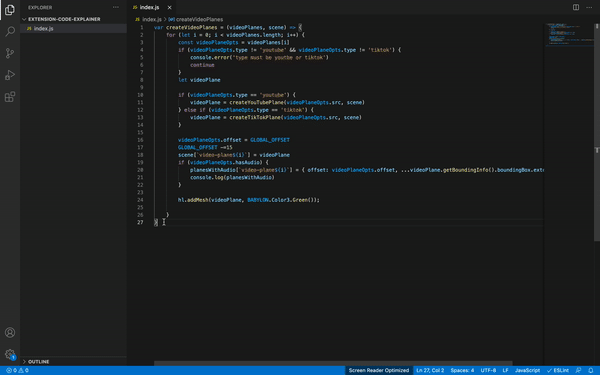

# Use GPT to turn code into Markdown!

Select a block of code (.py | .js | .ts) and right click it to generate markdown. Choose the temperature you want GPT to describe it as (low [COMDE - Low Temp], medium [COMDE - Medium Temp], or high [COMDE - High Temp]).
The result will be appended to your root directory under the `COMDE.md` file (see example on this project's GitHub).

Made by [bramses](https://twitter.com/_bramses)